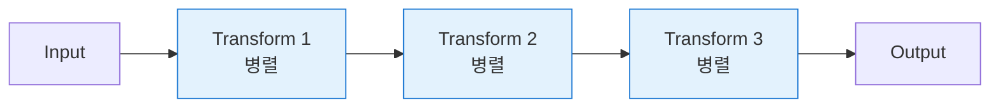

# 아키텍처 깊이 이해하기

> 세 라이브러리의 내부 동작 원리와 설계 철학을 상세히 알아봅니다.

## 📖 Pregel & Apache Beam이란?

LangGraph는 Google의 **Pregel**과 Apache **Beam**에서 영감을 받아 설계되었습니다:

### 1. Pregel (Google의 대규모 그래프 처리 시스템)

```
핵심 개념: Think-Like-A-Vertex (정점처럼 생각하기)

작동 방식:
1. 각 노드(vertex)가 메시지를 받음
2. 자신의 상태를 계산
3. 이웃 노드에 메시지 전송
4. 수렴할 때까지 반복 (BSP - Bulk Synchronous Parallel)

예시: PageRank 알고리즘
웹페이지(노드) → 링크(엣지) → 중요도 계산 → 이웃에 전파 → 반복
```

### 2. Apache Beam (통합 데이터 처리 프레임워크)

**핵심 개념:** 배치 + 스트리밍 통합 파이프라인

**작동 방식:**


**특징:**
- DAG (Directed Acyclic Graph): 비순환 방향 그래프
- 데이터 흐름 명확화
- 조건부 분기 지원

### LangGraph가 가져온 것

- **Pregel → 노드 독립성**: 각 노드가 독립적으로 상태 처리
- **Pregel → 메시지 전달**: 노드 간 상태(메시지) 전파
- **Pregel → 반복 실행**: 루프를 통한 반복 처리 가능
- **Beam → DAG 구조**: 명확한 파이프라인 흐름
- **Beam → 조건부 엣지**: 동적 라우팅 및 분기

### 코드 예시로 보는 차이

```typescript
// LangGraph (Pregel/Beam 스타일)
const workflow = new StateGraph(StateAnnotation)
  .addNode('node1', processNode1)  // 독립적 노드 (Pregel)
  .addNode('node2', processNode2)
  .addEdge('__start__', 'node1')   // DAG 파이프라인 (Beam)
  .addConditionalEdges('node1', router);  // 조건부 분기 (Beam)

// 각 노드 = 독립 함수 (Pregel의 vertex compute function)
function processNode1(state: State): State {
  // 상태 받음 → 처리 → 새 상태 반환 (메시지 전달)
  return { ...state, processed: true };
}

// XState (상태 머신 스타일)
const machine = createMachine({
  states: {
    idle: { on: { START: 'processing' } },    // 명확한 상태 정의
    processing: {
      entry: 'processData',                    // 상태 내 액션
      on: { DONE: 'completed' }
    }
  }
});
```

### 철학적 차이

| 측면 | LangGraph (그래프 처리) | XState (상태 머신) |
|------|------------------------|-------------------|
| 모델 | 노드 + 엣지 (데이터 흐름) | 상태 + 전이 (상태 변화) |
| 초점 | 데이터 변환, 파이프라인 | 상태 관리, 이벤트 |
| 반복 | 그래프 순회, 루프 | 상태 전이 순환 |
| 분산 | 대규모 병렬 처리 가능 | 단일 인스턴스 중심 |
| 용도 | LLM 체인, ETL | UI, 워크플로우 |

---

## 🏗️ 설계 철학 비교

세 라이브러리는 동일한 문제를 해결하지만, **근본적인 설계 철학**이 다릅니다.

### XState: 상태 머신 중심 (State-First)

**핵심 개념:** 상태는 불변이며, 전이는 명시적이어야 한다

- **상태 관리:** Context에 `orderStatus` + `retryCount` 포함
- **재시도 메커니즘:** 상태 머신은 상태와 전이만 정의, 재시도 로직은 외부 구독으로 처리
- **철학:** UI/애플리케이션 상태 머신처럼 "현재 어떤 상태인가"가 가장 중요
- **장점:** 시각화 가능, 타임 트래블 디버깅, 엄격한 타입 안전성

```typescript
// XState는 상태와 전이에 집중
context: {
  orderStatus: 'pending',
  retryCount: 0  // 재시도 횟수도 상태의 일부로 관리
}

// 재시도는 외부에서 이벤트로 트리거
orderActor.subscribe((state) => {
  if (state.value === 'payment_failed') {
    orderActor.send({ type: 'RETRY_PAYMENT' });
  }
});
```

### Mastra: 워크플로우 파이프라인 중심 (Pipeline-First)

**핵심 개념:** Step은 독립적인 단위이며, 내부 로직을 완전히 캡슐화한다

- **상태 관리:** Zod 스키마로 전체 상태 정의 (`orderStatus` + `retryCount`)
- **재시도 메커니즘:** Step 내부에 while 루프로 재시도 로직 포함
- **철학:** AI 워크플로우처럼 "각 단계가 무엇을 하는가"가 중요
- **장점:** LLM 재시도에 최적화, 독립적인 Step 테스트 가능, 코드 가독성

```typescript
// Mastra는 Step 내부에 모든 로직 포함
execute: async ({ inputData }) => {
  let state = { ...inputData, retryCount: 0 };

  // Step 내부에서 재시도 처리
  while (state.orderStatus !== 'paid' && state.retryCount < MAX_RETRIES) {
    // 결제 시도
    if (success) {
      state.orderStatus = 'paid';
      break;
    }
    state.retryCount++;
  }
  return state;
}
```

### LangGraph: 그래프 기반 라우팅 중심 (Graph-First)

**핵심 개념:** 노드는 단순하고, 엣지(라우팅)가 복잡성을 처리한다

- **상태 관리:** Annotation으로 상태 정의 (`orderStatus` + `retryCount` + `messages`)
- **재시도 메커니즘:** 조건부 엣지로 같은 노드로 재라우팅
- **철학:** AI 에이전트처럼 "어떤 경로로 흐를 것인가"가 중요
- **장점:** 동적 라우팅, 복잡한 분기 처리, 시각적으로 명확한 그래프

```typescript
// LangGraph는 노드는 단순하게, 라우팅으로 재시도
async function processPaymentNode(state) {
  // 노드는 1회 결제 시도만 수행
  if (success) return { orderStatus: 'paid' };
  return { retryCount: state.retryCount + 1 };
}

// 조건부 엣지가 재시도 여부 결정
function shouldRetryPayment(state) {
  if (state.retryCount < MAX_RETRIES) {
    return 'process_payment'; // 같은 노드로 다시 라우팅
  }
  return END;
}
```

### retryCount 필드 위치의 차이

| 라이브러리 | retryCount 위치 | 이유 |
|-----------|----------------|------|
| **XState** | Context에 포함 | 상태 머신의 상태로 관리, 외부 구독에서 참조 |
| **Mastra** | 스키마에 포함 | Step 내부 루프에서 직접 관리 |
| **LangGraph** | Annotation에 포함 | 조건부 엣지에서 라우팅 결정에 사용 |

**결론:** 세 라이브러리 모두 `retryCount`를 포함하지만, **어디서 어떻게 사용하는가**가 설계 철학을 반영합니다.

---

## ⚙️ 실행 모델 / 데이터 흐름 / 트리거 방식 비교

| 관점 | XState | Mastra | LangGraph |
|---|---|---|---|
| **실행 모델** | Actor 기반 상태 머신. 이벤트를 처리하며 상태/컨텍스트를 유지 | Step/Workflow 실행. Step을 순차/분기/병렬로 실행 | Graph 실행. 노드 실행 + 엣지(라우팅)로 그래프 순회 |
| **데이터 저장 위치** | `context` | workflow state(스키마 기반 입력/출력) | graph state(Annotation) |
| **데이터 흐름** | 이벤트 → 전이/액션 → `assign()`로 갱신 | Step 실행 결과가 다음 Step 입력으로 전달 | 노드가 partial update 반환 → state merge → 라우터가 다음 노드 결정 |
| **트리거(다음으로 가게 하는 것)** | `send(event)` + `always/after/invoke(onDone/onError)` | Step 완료/실패 + 워크플로우 조립(then/branch/parallel) 규칙 | 노드 완료 후 라우팅 함수 결과(`addConditionalEdges`) |
| **분기 표현** | guard 기반 전이(`guard`, `always`, `on` 배열 전이) | 조건 step/브랜치 구성(워크플로우 레벨) | 조건부 엣지(라우터 함수가 다음 노드명 반환) |
| **재시도 위치(전형)** | `error` 상태 + `after`/이벤트로 재시도 경로 모델링 | Step 내부 또는 workflow 레벨에서 재시도 패턴 구성 | 라우터가 같은 노드로 되돌리는 루프 엣지 구성 |

---

## 🔍 구현 차이점 심층 분석

### 1. 재시도 로직 구현 방식

**시나리오:** 결제 실패 시 최대 3회까지 재시도

#### XState 방식: 외부 구독 + 이벤트 전송
```typescript
// 상태 머신은 상태만 정의
states: {
  payment_failed: {
    entry: () => console.log('❌ 결제 실패')
  }
}

// 구독을 통해 상태 변화 감지 후 이벤트 전송
orderActor.subscribe((state) => {
  if (state.value === 'payment_failed') {
    setTimeout(() => orderActor.send({ type: 'RETRY_PAYMENT' }), 1500);
  }
});
```

**철학:**
- 상태 머신은 "무엇(What)"만 정의
- 외부 코드가 "언제(When)" 결정
- 명확한 상태 전이, 디버깅 용이

#### Mastra 방식: Step 내부 루프
```typescript
const processPayment = createStep({
  id: 'process-payment',
  execute: async ({ inputData }) => {
    let retryCount = 0;
    while (retryCount < MAX_RETRIES) {
      if (Math.random() > 0.3) {
        return { ...inputData, orderStatus: 'paid' };
      }
      retryCount++;
      await sleep(1000);
    }
    throw new Error('결제 실패');
  }
});
```

**철학:**
- Step이 완전히 독립적으로 동작
- 내부에서 모든 로직 처리
- AI 워크플로우에 적합 (LLM 재시도 등)

#### LangGraph 방식: 조건부 엣지
```typescript
const shouldRetryPayment = (state: OrderState): string => {
  if (state.orderStatus === 'pending' && state.retryCount < MAX_RETRIES) {
    return 'process_payment';  // 같은 노드로 다시 라우팅
  }
  return 'cancel_order';
};

workflow.addConditionalEdges('process_payment', shouldRetryPayment);
```

**철학:**
- 그래프 구조로 흐름 제어
- 라우터 함수가 다음 노드 결정
- 복잡한 분기 처리에 강력

---

### 2. 상태 관리 방식

| 측면 | XState | Mastra | LangGraph |
|------|--------|--------|-----------|
| **상태 저장 위치** | `context` 객체 | 각 Step 반환값 | `StateGraph` 전역 상태 |
| **상태 업데이트** | `assign()` 액션 | Step 체이닝 | Annotation 자동 병합 |
| **타입 안전성** | TypeScript 완벽 지원 | Zod 스키마 검증 | TypeScript + Annotation |
| **불변성** | 명시적 (assign으로만 변경) | 암묵적 (새 객체 반환) | 자동 (Annotation) |

**코드 예시:**

```typescript
// XState: 명시적 상태 업데이트
actions: assign({
  orderStatus: 'paid'
})

// Mastra: 새 객체 반환
return {
  ...inputData,
  orderStatus: 'paid'
};

// LangGraph: 부분 업데이트 자동 병합
return {
  orderStatus: 'paid'
  // 나머지 필드는 자동으로 유지됨
};
```

---

### 3. 비동기 처리

#### XState: `after` / `invoke`
```typescript
processing_payment: {
  after: {
    1000: [  // 1초 후 자동 전이
      { guard: isSuccess, target: 'success' },
      { target: 'failed' }
    ]
  }
}
```

**특징:**
- 선언적 비동기 처리
- 타이머, Promise, Observable 지원
- 취소 가능 (상태 전이 시 자동 취소)

#### Mastra: `async/await`
```typescript
const step = createStep({
  execute: async ({ inputData }) => {
    await sleep(1000);  // 명시적 대기
    const result = await processAPI();
    return result;
  }
});
```

**특징:**
- 익숙한 async/await 패턴
- Step 내부에서 완전히 제어
- 간단하고 직관적

#### LangGraph: Node 함수 자체가 비동기
```typescript
async function processPaymentNode(state: OrderState): Promise<Partial<OrderState>> {
  await delay(1000);
  // 처리 로직
  return { orderStatus: 'paid' };
}

workflow.addNode('process_payment', processPaymentNode);
```

**특징:**
- 노드 함수가 비동기 가능
- LLM 호출에 최적화 (스트리밍 지원)
- 병렬 실행 가능

---

### 4. 에러 처리

#### XState: 명시적 에러 상태
```typescript
states: {
  processing: { /* ... */ },
  success: { type: 'final' },
  error: { type: 'final' }  // 명시적 에러 상태
}
```

#### Mastra: try/catch + 워크플로우 레벨 에러 핸들링
```typescript
const workflow = createWorkflow({ /* ... */ })
  .then(step1)
  .then(step2)
  .onError((error) => {
    console.error('워크플로우 실패:', error);
    // 전역 에러 처리
  })
  .commit();
```

#### LangGraph: 조건부 엣지로 에러 라우팅
```typescript
function errorRouter(state: State): string {
  if (state.error) {
    return 'error_handler';
  }
  return 'next_step';
}

workflow.addConditionalEdges('risky_operation', errorRouter);
```

---

### 5. 코드 구조 비교

#### XState: 선언적 설정 객체
```typescript
const machine = createMachine({
  id: 'order',
  initial: 'draft',
  states: { /* ... */ }
});

const actor = createActor(machine);
actor.start();
actor.send({ type: 'EVENT' });
```

**장점:** 상태 다이어그램과 1:1 매칭, 시각화 쉬움
**단점:** 초기 학습 곡선

#### Mastra: 함수형 체이닝
```typescript
const workflow = createWorkflow({ /* ... */ })
  .then(step1)
  .then(step2)
  .after(step3)
  .commit();

await workflow.execute({ input });
```

**장점:** 직관적이고 읽기 쉬움, AI 통합 간편
**단점:** 복잡한 분기 처리 어려움

#### LangGraph: 그래프 빌더 패턴
```typescript
const workflow = new StateGraph(Annotation)
  .addNode('node1', fn1)
  .addNode('node2', fn2)
  .addEdge('node1', 'node2')
  .addConditionalEdges('node2', router)
  .compile();

await workflow.invoke(input);
```

**장점:** 복잡한 흐름 표현 강력, 동적 라우팅
**단점:** LangChain 의존성

---

## 💡 핵심 인사이트

1. **Mastra는 XState의 상위 레이어입니다**
   - Mastra = XState + AI 워크플로우 추상화 + OpenTelemetry
   - 같은 상태 머신 엔진을 공유하지만, Mastra는 AI 워크플로우에 특화된 API 제공
   - XState를 직접 사용하면 더 세밀한 제어 가능, Mastra는 더 간단한 API

2. **LangGraph는 완전히 다른 철학입니다**
   - Pregel/Apache Beam의 분산 그래프 처리 패러다임
   - LLM 에이전트를 위한 특수 목적 상태 머신
   - XState/Mastra와 다른 독립적인 구현

3. **도메인이 중요합니다**: 각 라이브러리는 특정 도메인에 최적화되어 있습니다.

4. **오버엔지니어링 주의**: 간단한 상태는 간단한 방법으로 관리하세요.

5. **혼합 사용 가능**: 프론트엔드는 XState, 백엔드는 Mastra/LangGraph 조합도 좋습니다.

---

## 📚 아키텍처 관계도

```
┌─────────────────────────────────────────────┐
│  XState (Core State Machine Library)       │
│  - Finite State Machines                   │
│  - Statecharts                             │
│  - Actor Model                             │
└──────────────┬──────────────────────────────┘
               │
               │ (builds on top)
               ↓
┌─────────────────────────────────────────────┐
│  Mastra Workflow                            │
│  - XState + AI 워크플로우 추상화             │
│  - .step() / .then() / .after() API        │
│  - OpenTelemetry 추적                       │
└─────────────────────────────────────────────┘

           (독립적)

┌─────────────────────────────────────────────┐
│  LangGraph                                  │
│  - Pregel/Apache Beam 영감                 │
│  - StateGraph (독자적 구현)                 │
│  - LLM 에이전트 특화                        │
└─────────────────────────────────────────────┘
```

## 📖 참고 자료

- [Askar Yusupov on X: Mastra workflow graph built on XState](https://x.com/pyoner/status/1895433535739265105)
- [Mastra Beta Launch - XState-based workflow](https://mastra.ai/blog/beta-launch)
- [Mastra Workflows Documentation](https://mastra.ai/docs/workflows/overview)
- [LangGraph Architecture and Design](https://medium.com/@shuv.sdr/langgraph-architecture-and-design-280c365aaf2c)
- [Building LangGraph from first principles](https://blog.langchain.com/building-langgraph/)
- [LangGraph Official Documentation](https://docs.langchain.com/oss/python/langgraph/overview)

---

**이전:** [LLM 챗봇 워크플로우 비교](./llm-chatbot.md)로 돌아가기
**메인:** [워크플로우 비교 개요](../README.md)로 돌아가기
