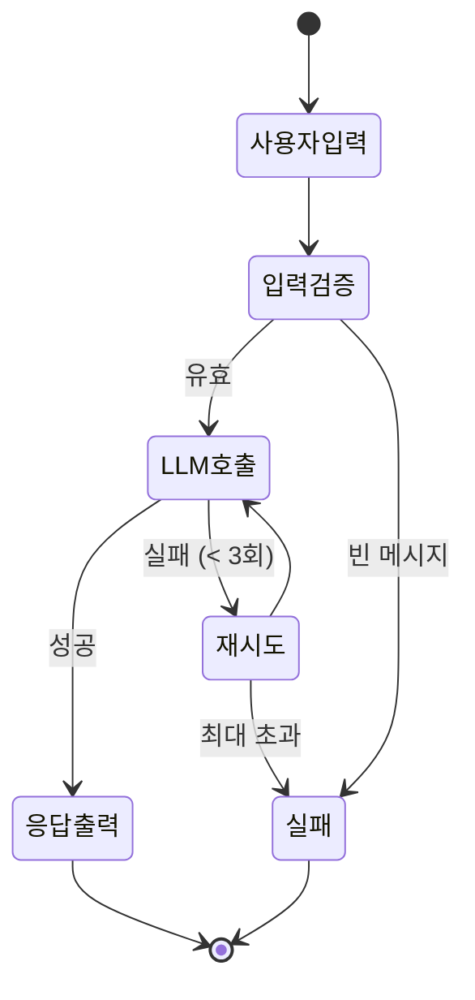

# LLM 챗봇 워크플로우 비교

> **핵심 질문:** LLM 챗봇을 만들 때 어떤 라이브러리를 선택해야 할까?

동일한 LLM 챗봇 워크플로우를 세 가지 라이브러리로 구현하여 비교합니다.

## 왜 LLM에 FSM/워크플로우가 필요한가?

LLM은 비결정적이지만, **워크플로우는 결정적**이어야 합니다. FSM/워크플로우는 다음과 같은 이점을 제공합니다:

### 핵심 이점

1. **🎯 비결정적 출력 제어**
   - LLM 출력은 매번 다를 수 있지만, FSM은 **흐름을 결정적**으로 만듭니다
   - 예: "사용자 입력 → 검증 → LLM 호출 → 응답" 순서는 항상 동일

2. **💰 비용 절감 (4-6배)**
   - StateFlow 연구: 각 상태에 맞는 **짧은 프롬프트**만 전송하여 비용 절감
   - 출처: [StateFlow: Enhancing LLM Task-Solving (arXiv)](https://arxiv.org/abs/2403.11322)

3. **🔒 보안 강화**
   - 명시적 상태 전이로 **프롬프트 인젝션 방어**
   - 각 상태에서 필요한 도구만 접근 가능 (최소 권한 원칙)

4. **🔄 재시도 및 복구**
   - LLM API 실패 시 **명확한 재시도 로직**
   - 실패 횟수, 대기 시간 등을 상태 머신에 명시

5. **🧠 작업 분해 및 검증**
   - 복잡한 대화를 **단계별로 분해**하여 각 단계 검증 가능
   - 오류 전파 방지 및 디버깅 용이

> **결론:** FSM/워크플로우는 LLM의 창의성은 유지하면서, 제어 가능성, 비용 효율성, 안정성을 제공합니다.

---

## 챗봇 워크플로우 흐름



## 라이브러리별 LLM 재시도 전략 비교

각 라이브러리가 LLM 호출 실패를 처리하는 방식이 다릅니다:

### XState: 상태 + after + guard

```typescript
states: {
  calling_llm: {
    invoke: {
      src: fromPromise(async () => await callLLM()),
      onDone: { target: 'response_ready' },
      onError: { target: 'error' }
    }
  },
  error: {
    after: {
      1500: [
        {
          guard: ({ context }) => context.retryCount < 3,
          target: 'calling_llm',  // 재시도
          actions: assign({ retryCount: (ctx) => ctx.retryCount + 1 })
        },
        { target: 'failed' }  // 최대 재시도 초과
      ]
    }
  }
}
```

**특징:**
- ✅ 재시도 로직이 상태 머신에 명시적으로 표현됨
- ✅ 시각화 도구에서 재시도 경로를 볼 수 있음
- ✅ 각 경로를 독립적으로 테스트 가능
- ⚠️ 재시도 로직이 상태 정의와 분리됨 (after, guard 조합 필요)

### Mastra: Step 내부 while 루프

```typescript
const callLLM = createStep({
  id: 'call-llm',
  execute: async ({ inputData }) => {
    let state = { ...inputData };
    let success = false;

    while (!success && state.retryCount < MAX_RETRIES) {
      try {
        const response = await callLLM(state.conversationHistory);
        state = { ...state, currentResponse: response, status: 'success' };
        success = true;
      } catch (error) {
        state.retryCount++;
        await delay(1500);
      }
    }

    if (!success) {
      state.status = 'failed';
    }
    return state;
  }
});
```

**특징:**
- ✅ Step이 독립적으로 재시도 로직을 완전히 제어
- ✅ AI 작업(LLM 호출)의 재시도에 특히 적합
- ✅ 워크플로우 그래프는 단순하게 유지
- ✅ [Workflow state](https://mastra.ai/docs/workflows/workflow-state)로 상태 영속화 및 suspend/resume 지원
- ⚠️ Step 내부 로직이 복잡해질 수 있음

### LangGraph: 조건부 엣지 (Conditional Edges)

```typescript
// 노드는 단일 작업만 수행 (LLM 호출 1회)
async function callLLMNode(state) {
  try {
    const response = await callLLM(state.conversationHistory);
    return { currentResponse: response, status: 'success' };
  } catch (error) {
    return { retryCount: state.retryCount + 1, status: 'processing' };
  }
}

// 조건부 엣지가 재시도 여부 결정
function routeAfterLLMCall(state) {
  if (state.status === 'success') {
    return 'display_response';
  }
  if (state.retryCount < MAX_RETRIES) {
    return 'call_llm';  // 같은 노드로 다시 라우팅 (루프)
  }
  return 'handle_failure';
}

workflow.addConditionalEdges('call_llm', routeAfterLLMCall);
```

**특징:**
- ✅ 워크플로우 그래프 자체가 재시도 경로를 명시적으로 표현
- ✅ 노드는 순수하고 테스트하기 쉬움 (관심사의 분리)
- ✅ 복잡한 분기 처리에 강력
- ⚠️ 그래프 구조 이해 필요

## 재시도 전략 비교표

| 측면 | XState | Mastra | LangGraph |
|------|--------|--------|-----------|
| **재시도 위치** | 상태 머신 (`after` + `guard`) | Step 내부 (`while` 루프) | 조건부 엣지 (그래프 라우팅) |
| **코드 응집도** | 분산 (상태 정의 + after + guard) | 높음 (Step 내부에 모두 포함) | 중간 (노드 + 라우터 함수) |
| **Durable Execution** | ❌ (메모리 기반) | ⭐⭐⭐ (상태 영속화, suspend/resume) | ⭐ (제한적 지원) |
| **시각화** | ⭐⭐⭐ (상태 다이어그램) | ⭐ (워크플로우 그래프) | ⭐⭐ (노드 + 엣지 그래프) |
| **테스트 용이성** | ⭐⭐⭐ (각 상태 독립 테스트) | ⭐⭐ (Step 단위 테스트) | ⭐⭐⭐ (노드 + 라우터 분리) |
| **LLM 통합** | ⭐ (수동) | ⭐⭐⭐ (네이티브) | ⭐⭐⭐ (LLM 특화) |
| **적합한 경우** | UI 챗봇, 명확한 상태 전이 | 장기 실행 AI 파이프라인 | LLM 에이전트, 복잡한 대화 |

## LLM 워크플로우 선택 가이드

### XState Chatbot을 선택하세요:
- ✓ 프론트엔드 UI와 통합되는 챗봇
- ✓ 상태 전이를 명확히 시각화하고 싶을 때
- ✓ 타입 안전성과 디버깅이 중요
- ✓ React/Vue와 함께 사용

### Mastra Chatbot을 선택하세요:
- ✓ 장기 실행 백엔드 AI 워크플로우 (서버리스 함수, API)
- ✓ 상태 영속화와 suspend/resume이 필요한 경우
- ✓ 다양한 LLM 제공자 통합 (OpenAI, Anthropic, Google 등 40+ 지원)
- ✓ 복잡한 재시도 로직이 필요한 경우
- ✓ Inngest와 같은 durable execution 런타임 활용

### LangGraph Chatbot을 선택하세요:
- ✓ LLM 에이전트 기반 시스템 (ReAct, Reflection)
- ✓ 도구 호출(Tool Calling)이 필요한 경우
- ✓ 멀티 에이전트 협업
- ✓ LangChain 생태계 사용 중

## 핵심 통찰

### 1. 패턴의 유사성

세 라이브러리 모두 동일한 문제(LLM 재시도)를 해결하지만, 접근 방식이 다릅니다:

- **XState**: 상태 중심 (State-First)
  - 상태 머신으로 모든 전이를 명시적으로 모델링

- **Mastra**: Step/Workflow 중심 + Stateful Durable Execution
  - Step 기반 워크플로우 구성 + 상태 영속화 및 suspend/resume 지원
  - [Inngest 통합](https://mastra.ai/docs/workflows/inngest-workflow)으로 step memoization과 자동 재시도

- **LangGraph**: 그래프 중심 (Graph-First)
  - 노드와 조건부 엣지로 동적 라우팅 구현

### 2. LLM 통합은 일반 비동기 작업의 연장선

- `02-xstate-examples`의 `fetch-example.ts`와 `llm-chat.ts`는 동일한 패턴
- `invoke` + `fromPromise`는 REST API든 LLM API든 상관없이 동작
- 재시도 로직도 동일 (guard 기반 조건부 전이)

### 3. 복잡도와 유연성의 트레이드오프

- **XState**: 명확하지만 초기 설정이 복잡
  - 장점: 명시적 상태 전이, 우수한 시각화, UI 통합
  - 단점: 학습 곡선, durable execution 미지원

- **Mastra**: Step 단순성 + Durable Execution
  - 장점: 상태 영속화, 장기 실행 워크플로우, 다양한 LLM 통합
  - 단점: 복잡한 분기 처리 어려움, 그래프 시각화 제한적

- **LangGraph**: 강력한 에이전트 중심 설계
  - 장점: 동적 라우팅, LLM 에이전트 특화, 도구 호출
  - 단점: LangChain 의존성, 그래프 구조 학습 필요

---

**다음:** [아키텍처 깊이 이해하기](./architecture.md)에서 Pregel, Apache Beam, XState의 내부 동작을 상세히 알아봅니다.
