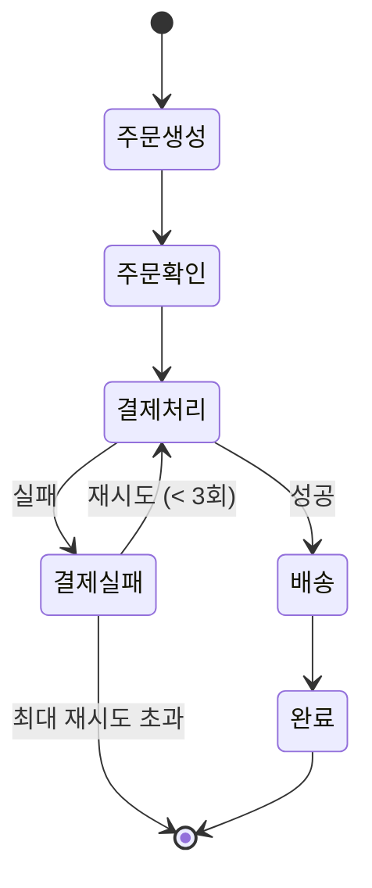

# 주문 처리 워크플로우 비교

> 동일한 주문 처리 워크플로우를 XState, Mastra, LangGraph 세 가지 라이브러리로 구현하며 각각의 철학과 장단점을 비교합니다.

## 🔄 공통 워크플로우

모든 예제는 다음과 같은 주문 처리 흐름을 구현합니다:

## 상세 비교

### 1. XState

**주요 특징:**
- 📐 **명확한 상태 정의**: 모든 상태와 전이를 선언적으로 정의
- 🎨 **시각화 도구**: Stately Studio로 상태 다이어그램 자동 생성
- 🔒 **타입 안전성**: TypeScript 완벽 지원
- ⚡ **동기/비동기 처리**: Promise, Observable 등 다양한 비동기 패턴 지원

**적합한 사용 사례:**
- 복잡한 UI 상태 관리 (폼, 모달, 위저드 등)
- 사용자 인터랙션이 많은 애플리케이션
- 명확한 상태 전이가 중요한 시스템

**장점:**
- ✅ 시각적으로 이해하기 쉬움
- ✅ 테스트 작성이 용이
- ✅ 프레임워크 독립적 (React, Vue, Svelte 등)

**단점:**
- ❌ 학습 곡선이 있음
- ❌ 간단한 상태에는 오버엔지니어링일 수 있음

---

### 2. Mastra Workflow

> **💡 중요:** Mastra는 **XState 위에 구축**되었습니다! XState를 기반으로 워크플로우 그래프 시스템을 만들고 OpenTelemetry 추적을 추가했습니다.

**주요 특징:**
- 🤖 **AI 우선 설계**: LLM 및 AI 모델과의 쉬운 통합
- 🔄 **Step 기반 워크플로우**: 각 단계를 독립적인 함수로 구성
- 📊 **데이터 파이프라인**: 단계 간 데이터 흐름 관리
- 🔌 **유연한 통합**: 다양한 서비스와 API 연동 가능
- ⚡ **XState 기반**: Stately AI의 XState를 활용한 그래프 기반 엔진

**XState와의 관계:**
- `createWorkflow()` / `createStep()` + `.then()` 체이닝으로 흐름 구성
- `.suspend()` / `.resume()` API로 human-in-the-loop 워크플로우 지원
- XState의 상태 머신 기능 + AI 워크플로우에 최적화된 추상화

**적합한 사용 사례:**
- AI 기반 자동화 워크플로우
- 복잡한 비즈니스 로직 처리
- ETL 및 데이터 처리 파이프라인
- 백엔드 서비스 오케스트레이션

**장점:**
- ✅ AI 통합이 자연스러움
- ✅ 각 단계를 독립적으로 테스트 가능
- ✅ 코드가 직관적이고 읽기 쉬움

**단점:**
- ❌ UI 상태 관리에는 적합하지 않음
- ❌ 복잡한 조건부 분기 처리가 번거로울 수 있음

---

### 3. LangGraph

> **💡 중요:** LangGraph는 **독자적인 구현**입니다! Pregel과 Apache Beam에서 영감을 받아 만든 독립적인 상태 머신입니다.

**주요 특징:**
- 🧠 **LLM 네이티브**: LangChain 생태계와 완벽 통합
- 🔀 **그래프 기반**: 노드와 엣지로 복잡한 흐름 표현 (DAG 기반 오케스트레이션)
- 🎯 **동적 라우팅**: 조건부 엣지로 동적 흐름 제어
- 🤖 **에이전트 지향**: 자율적인 AI 에이전트 구축에 최적화

**아키텍처:**
- **Pregel & Apache Beam** 영감: 분산 그래프 처리 패러다임
- **StateGraph**: 워크플로우의 컨트롤러 또는 블루프린트
- **NetworkX 스타일 API**: 익숙한 그래프 인터페이스
- **독립적 구현**: XState와 무관한 자체 상태 머신

**적합한 사용 사례:**
- LLM 기반 AI 에이전트
- 대화형 시스템 및 챗봇
- 복잡한 의사결정 트리
- RAG (Retrieval-Augmented Generation) 파이프라인

**장점:**
- ✅ LLM과의 통합이 매우 강력
- ✅ 복잡한 에이전트 로직을 명확하게 표현
- ✅ 메시지 히스토리 관리가 내장됨

**단점:**
- ❌ LangChain 의존성
- ❌ LLM이 필요 없는 경우 오버헤드

---

## 📋 비교표

| 항목 | XState | Mastra Workflow | LangGraph |
|------|--------|-----------------|-----------|
| **기반 기술** | 독자적 FSM | **XState + 추상화** | Pregel/Apache Beam |
| **주요 목적** | UI/앱 상태 관리 | 비즈니스 워크플로우 | LLM 에이전트 |
| **구현 방식** | 상태 차트 | XState 래퍼 | StateGraph (DAG) |
| **학습 곡선** | 중간 | 낮음 | 중간-높음 |
| **시각화** | ⭐⭐⭐ (Stately Studio) | ⭐ (XState 도구 활용 가능) | ⭐⭐ |
| **타입 안전성** | ⭐⭐⭐ | ⭐⭐ (XState 상속) | ⭐⭐ |
| **AI 통합** | ⭐ (수동) | ⭐⭐⭐ (네이티브) | ⭐⭐⭐ (LLM 특화) |
| **프론트엔드** | ⭐⭐⭐ | ⭐ | ⭐ |
| **백엔드** | ⭐⭐ | ⭐⭐⭐ | ⭐⭐⭐ |
| **테스트 용이성** | ⭐⭐⭐ | ⭐⭐ | ⭐⭐ |
| **관계** | 기본 라이브러리 | **XState 기반** | 독립적 |

## 🎯 라이브러리 선택 가이드

### XState를 선택하세요:
- ✓ React/Vue/Svelte 등 프론트엔드 프레임워크 사용
- ✓ 복잡한 UI 상태 관리가 필요
- ✓ 상태 머신을 시각화하고 싶음
- ✓ 타입 안전성이 중요

### Mastra Workflow를 선택하세요:
- ✓ AI 모델과 통합이 필요
- ✓ 백엔드 비즈니스 로직 구현
- ✓ 데이터 처리 파이프라인 구축
- ✓ 간단하고 직관적한 코드 선호
- ✓ **XState의 강력함 + AI 워크플로우의 편의성** 모두 원함

### LangGraph를 선택하세요:
- ✓ LLM 기반 에이전트 개발
- ✓ LangChain 생태계 사용 중
- ✓ 복잡한 대화형 시스템 구축
- ✓ RAG 파이프라인 구현

---

**다음:** [LLM 챗봇 워크플로우 비교](./llm-chatbot.md)에서 세 라이브러리의 재시도 전략을 상세히 비교합니다.
