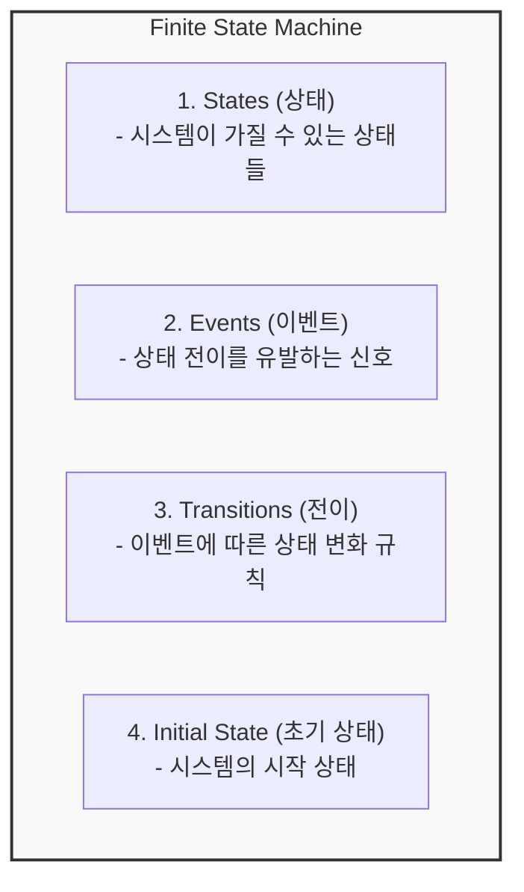
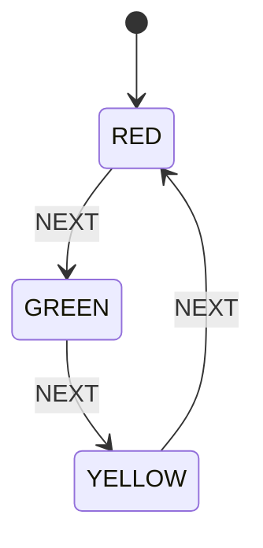
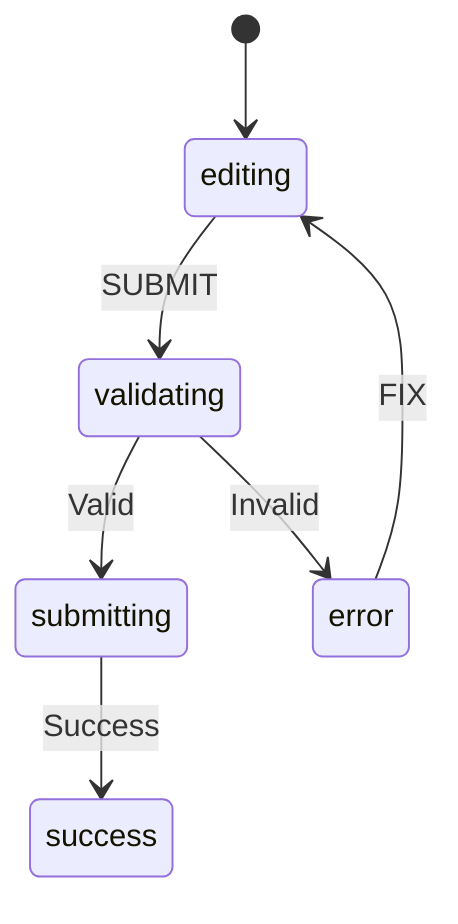
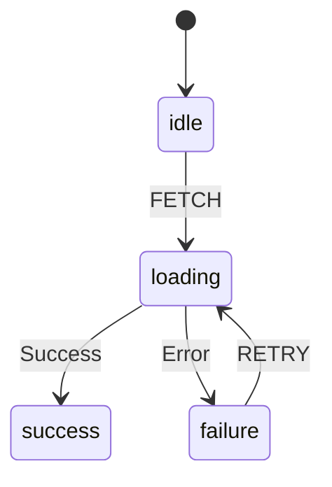
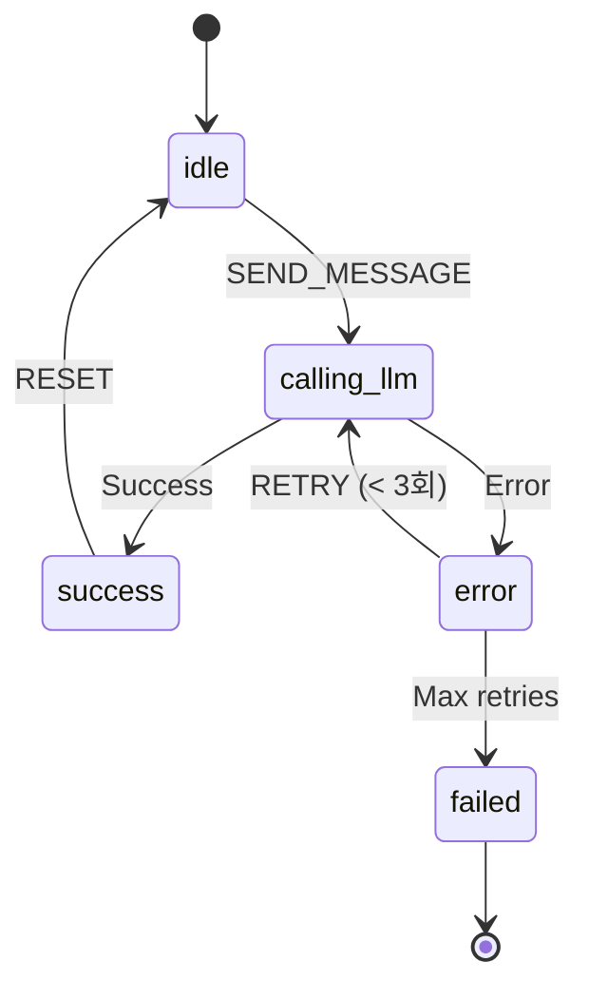
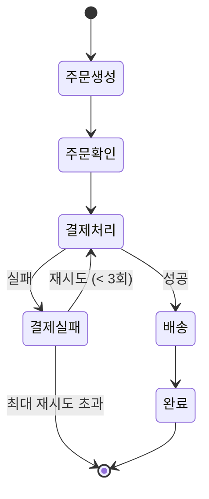
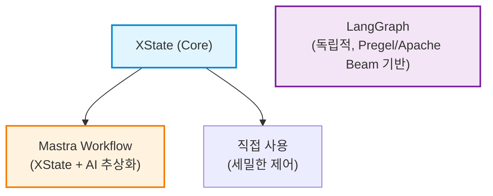
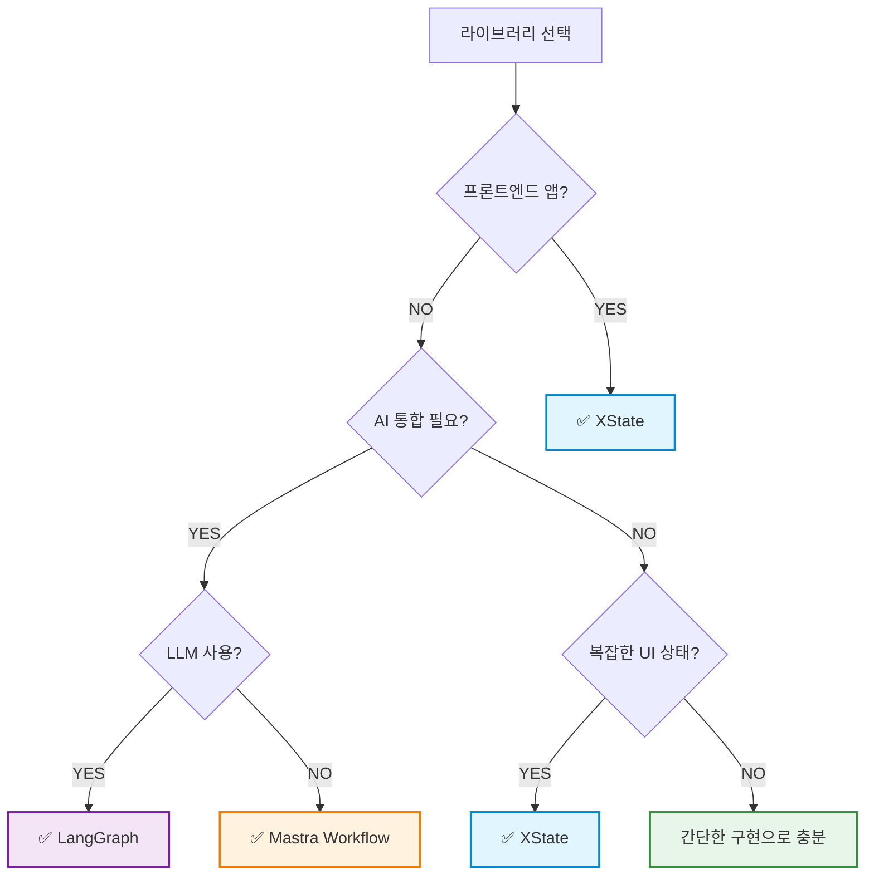

# 유한 상태 기계 (Finite State Machine) 발표 자료

> 복잡한 상태 로직을 명확하고 예측 가능하게 관리하는 방법

---

## 📋 목차

1. [FSM의 정의](#1-fsm의-정의)
   - 1.1. [개념](#11-개념)
   - 1.2. [핵심 구성요소](#12-핵심-구성요소)
   - 1.3. [간단한 예제: 신호등](#13-간단한-예제-신호등)
   - 1.4. [왜 FSM을 사용하는가?](#14-왜-fsm을-사용하는가)
   - 1.5. [실제 사용 사례](#15-실제-사용-사례)
2. [XState를 사용한 FSM 구현](#2-xstate를-사용한-fsm-구현)
3. [왜 LLM 워크플로우에 FSM인가?](#3-왜-llm-워크플로우에-fsm인가)
4. [워크플로우 라이브러리 비교](#4-워크플로우-라이브러리-비교)
   - 4.1. [XState vs Mastra vs LangGraph](#41-xstate-vs-mastra-vs-langgraph)
5. [FSM 관련 추가 주제](#5-fsm-관련-추가-주제)
6. [실습 가이드](#6-실습-가이드)
7. [참고 자료](#7-참고-자료)
8. [핵심 요약](#8-핵심-요약)
9. [다음 단계](#9-다음-단계)

---

## 1. FSM의 정의

### 1.1 개념

**유한 상태 기계(Finite State Machine, FSM)**는 시스템이 가질 수 있는 **유한한 개수의 상태**와 그 상태들 간의 **전이(transition)** 규칙을 정의한 계산 모델입니다.

### 1.2 핵심 구성요소



### 1.3 간단한 예제: 신호등



**상태**: RED, GREEN, YELLOW
**이벤트**: NEXT
**전이 규칙**: RED → GREEN → YELLOW → RED (순환)

### 1.4 왜 FSM을 사용하는가?

| 장점 | 설명 |
|------|------|
| 🎯 **명확성** | 복잡한 상태 로직을 시각적으로 표현 |
| 🔮 **예측 가능성** | 모든 상태와 전이를 명시적으로 정의 |
| 🐛 **디버깅 용이** | 상태 흐름을 쉽게 추적 |
| 🧪 **테스트 용이** | 각 상태와 전이를 독립적으로 테스트 |
| 📚 **문서화** | 다이어그램 자체가 문서 역할 |

### 1.5 실제 사용 사례

- ✅ **UI 상태 관리**: 폼 유효성 검사, 모달, 위저드
- ✅ **비즈니스 로직**: 주문 처리, 승인 워크플로우
- ✅ **게임 개발**: 캐릭터 상태, 게임 진행
- ✅ **네트워크 프로토콜**: TCP 연결 상태
- ✅ **임베디드 시스템**: 기기 제어 로직

---

## 2. XState를 사용한 FSM 구현

### XState란?

[XState](https://xstate.js.org/)는 JavaScript/TypeScript를 위한 강력한 상태 관리 라이브러리입니다. 유한 상태 기계(FSM)와 상태 차트(Statecharts)를 구현할 수 있으며, 복잡한 애플리케이션 로직을 명확하고 예측 가능하게 관리할 수 있습니다.

**핵심 특징:**
- ✅ TypeScript 완벽 지원
- 🎨 시각화 도구 ([Stately Studio](https://stately.ai/studio))
- 🔄 비동기 작업 지원 (Promise, Observable)
- 📦 프레임워크 독립적 (React, Vue, Svelte 등)

### 기본 사용법

```typescript
import { createMachine, createActor } from 'xstate';

// 1. 머신 정의
const toggleMachine = createMachine({
  id: 'toggle',
  initial: 'inactive',
  states: {
    inactive: {
      on: { TOGGLE: 'active' }
    },
    active: {
      on: { TOGGLE: 'inactive' }
    }
  }
});

// 2. Actor 생성
const actor = createActor(toggleMachine);
actor.start();

// 3. 이벤트 전송
actor.send({ type: 'TOGGLE' }); // inactive -> active
```

### 실용적인 예제

#### 1) 폼 유효성 검사



- 입력 값 실시간 검증
- 에러 메시지 관리
- 제출 성공/실패 처리

#### 2) 비동기 데이터 페칭



- Promise 통합
- 재시도 로직
- 에러 처리

#### 3) Context를 활용한 데이터 관리

```typescript
import { createMachine, assign } from 'xstate';

const counterMachine = createMachine({
  context: { count: 0 },
  states: {
    active: {
      on: {
        INCREMENT: {
          actions: assign({
            count: ({ context }) => context.count + 1
          })
        }
      }
    }
  }
});
```

### 시각화 도구

XState는 **Stately Studio**에서 머신을 시각적으로 편집하고 테스트할 수 있습니다.

```bash
# 프로젝트에 시각화 도구 추가
pnpm add @statelyai/inspect
```

---

## 3. 왜 LLM 워크플로우에 FSM인가?

### 역설: 비결정적 LLM + 결정적 FSM = 🎯 제어 가능한 AI

**핵심 질문:** LLM은 비결정적인데, 왜 결정적인 FSM을 사용하는가?

**답:** FSM은 LLM의 **비결정성을 제어**하고, **워크플로우 자체를 결정적**으로 만듭니다.

### LLM 워크플로우의 특성

| 특성 | 일반 로직 | LLM 워크플로우 |
|------|----------|--------------|
| **예측 가능성** | 높음 (결정적) | 낮음 (비결정적) |
| **분기 복잡도** | 단순 | 복잡 (Tool Calling, 재시도) |
| **상태 중요도** | 중간 | 매우 높음 (메모리, 히스토리) |
| **에러 처리** | 표준 패턴 | LLM 특화 (재시도, fallback) |
| **실행 시간** | 짧음 | 장기 실행 (Long-running) |

**출처:**
- [LangGraph Overview](https://docs.langchain.com/oss/javascript/langgraph/overview) - Long-running, stateful agents
- [Mastra Workflows Overview](https://mastra.ai/docs/workflows/overview) - Structured workflow steps

---

### FSM이 LLM에 적합한 이유

#### 1. 🎯 비결정적 출력을 결정적 흐름으로 제어

**문제:**
- LLM 출력은 매번 다를 수 있음 (temperature, sampling)
- 예측 불가능한 응답으로 인한 시스템 불안정

**FSM 솔루션:**
```typescript
// ❌ 비제어: LLM이 모든 것을 결정
const response = await llm.chat("주문을 처리해줘");
// → 예측 불가능: 주문 확인? 결제? 배송? 뭘 할지 모름

// ✅ 제어: FSM이 흐름을 결정, LLM은 각 단계만 수행
states: {
  confirmOrder → processPayment → ship → complete
  // → 명확한 순서, LLM은 각 단계의 "어떻게"만 결정
}
```

#### 2. 💰 비용 절감 (4-6배)

**StateFlow 논문 (2024) 실증:**  
출처: https://arxiv.org/abs/2403.11322

| 벤치마크 | 성공률 개선 | 비용 절감 |
|---------|-----------|---------|
| InterCode SQL | **+13%** | **5×** 감소 |
| ALFWorld | **+28%** | **3×** 감소 |

**비용 절감 원리:**
- **ReAct (기존 방식):** 매 단계마다 긴 프롬프트 + 예제 전송
  ```
  Prompt (5000 tokens) × 10 steps = 50,000 tokens
  ```
- **StateFlow (FSM 방식):** 각 상태에 맞는 짧은 프롬프트만 전송
  ```
  Prompt (1000 tokens) × 10 steps = 10,000 tokens (5배 절감)
  ```

**핵심:**
> "StateFlow는 'process grounding'(상태 전이를 통한 진행 추적)과 'sub-task solving'(각 상태 내 액션)을 분리하여, **명확한 추적**과 **비용 효율성**을 달성합니다."

----

#### 3. 🔒 견고성 및 안정성

**리스크 완화 포인트:**
- ✅ 명시적 전이로 의도치 않은 흐름을 줄임
- ✅ 상태별 검증 지점을 두어 오류를 조기에 차단
- ✅ 실행 로그를 통해 재현성과 추적성을 확보

---

#### 4. 🧠 작업 분해 및 검증

**StateFlow 접근:**

```
복잡한 작업
  ↓ FSM으로 분해
State 1: 정보 수집 → Action: LLM 질문 생성
  ↓ 검증 (충분한 정보?)
State 2: 분석 → Action: LLM 데이터 분석
  ↓ 검증 (분석 정확성?)
State 3: 결론 → Action: LLM 보고서 작성
  ✓ 각 단계별 검증 및 자기 수정 가능
```

**이점:**
- 설명 가능성 (Explainability) 향상
- 신뢰성 (Trustworthiness) 증가
- 오류 전파 방지

**출처:** https://arxiv.org/abs/2403.11322

---

#### 5. 🔄 순환 및 장기 실행 지원

**LangGraph의 핵심 강점:**
> "LangGraph는 **순환(cycles)을 포함하는 LLM 워크플로우**를 생성 가능하며, 이는 대부분의 에이전트 런타임의 핵심 구성 요소입니다."

**예시:**
```typescript
// 재시도 루프 (LLM이 실패할 수 있음)
calling_llm → error → (조건: retryCount < 3) → calling_llm
                   → (조건: retryCount >= 3) → failed

// Human-in-the-loop
draft → review → (승인?) → publish
              → (거부?) → draft (수정 후 재시도)
```

**출처:** [LangGraph overview](https://docs.langchain.com/oss/javascript/langgraph/overview)

---

### 실무 예제: XState에서 LLM 호출

**핵심 통찰: LLM 호출도 일반 비동기 작업과 동일한 패턴!**

```typescript
// 패턴 1: REST API 호출
invoke: {
  src: fromPromise(async () => {
    return await fetch('/api/users/1');
  }),
  onDone: { target: 'success' },
  onError: { target: 'error' }
}

// 패턴 2: LLM API 호출
invoke: {
  src: fromPromise(async () => {
    return await openai.chat.completions.create({
      model: 'gpt-4o-mini',
      messages: [{ role: 'user', content: message }]
    });
  }),
  onDone: { target: 'success' },
  onError: { target: 'error' }
}
```

**→ 완전히 동일한 패턴입니다!**

XState는 "무엇을 호출하는가"에 무관심합니다:
- REST API 호출? → `invoke` + `fromPromise`
- LLM 호출? → `invoke` + `fromPromise`
- DB 쿼리? → `invoke` + `fromPromise`

---

### LLM 재시도 패턴

LLM API는 다양한 이유로 실패할 수 있습니다:
- 네트워크 타임아웃
- API 요율 제한 (Rate Limit)
- 서버 과부하

XState의 `guard`와 `after`를 사용하여 재시도 로직을 명확히 정의:

```typescript
error: {
  entry: ({ context }) => {
    console.log(`재시도 횟수: ${context.retryCount}/3`);
  },
  after: {
    1500: [
      {
        guard: ({ context }) => context.retryCount < 3,
        target: 'calling_llm',
        actions: assign({
          retryCount: ({ context }) => context.retryCount + 1
        })
      },
      {
        target: 'failed'
      }
    ]
  }
}
```

---

### 💡 핵심 요약

| LLM의 문제 | FSM의 해결책 | 실증 결과 |
|-----------|------------|---------|
| 비결정적 출력 | 결정적 흐름 제어 | 안정성 향상 |
| 높은 비용 | 짧은 프롬프트 × 단계별 실행 | **4-6배 비용 절감** |
| 보안 취약점 | 명시적 상태 전이 | 프롬프트 인젝션 방어 |
| 오류 전파 | 단계별 검증 | 28% 성공률 향상 |
| 복잡한 워크플로우 | 작업 분해 + 순환 지원 | 장기 실행 가능 |

**결론:**
> FSM은 LLM의 **창의성과 유연성**은 유지하면서, **제어 가능성, 비용 효율성, 안정성**을 제공합니다.

---

### 간단한 LLM 챗봇 FSM



**핵심 이점:**
- 모든 가능한 상태를 명시적으로 정의
- 재시도 로직이 상태 다이어그램에 표현됨
- 타입 안전성으로 버그 방지
- 시각화 도구로 디버깅 용이

**실습 예제:** [02-xstate-examples/src/llm-chat.ts](../02-xstate-examples/src/llm-chat.ts)

---

## 4. 워크플로우 라이브러리 비교

### 비교 대상

1. **XState** - UI/애플리케이션 상태 관리
2. **Mastra Workflow** - AI 통합 비즈니스 워크플로우
3. **LangGraph** - LLM 기반 에이전트 워크플로우

### 공통 예제: 주문 처리 워크플로우

모든 라이브러리로 동일한 주문 처리 시스템을 구현하여 비교합니다.



---

## 4.1. XState vs Mastra vs LangGraph

### 아키텍처 관계

> **💡 중요 발견:** Mastra는 XState 위에 구축되었고, LangGraph는 독립적인 구현입니다!



### 상세 비교표

| 항목 | XState | Mastra Workflow | LangGraph |
|------|--------|-----------------|-----------|
| **기반 기술** | 독자적 FSM | **XState + 추상화** | Pregel/Apache Beam |
| **주요 목적** | UI/앱 상태 관리 | 비즈니스 워크플로우 | LLM 에이전트 |
| **구현 방식** | 상태 차트 | XState 래퍼 | StateGraph (DAG) |
| **학습 곡선** | 중간 | 낮음 | 중간-높음 |
| **시각화** | ⭐⭐⭐ (Stately Studio) | ⭐ (XState 도구 활용 가능) | ⭐⭐ |
| **타입 안전성** | ⭐⭐⭐ | ⭐⭐ (XState 상속) | ⭐⭐ |
| **AI 통합** | ⭐ (수동) | ⭐⭐⭐ (네이티브) | ⭐⭐⭐ (LLM 특화) |
| **프론트엔드** | ⭐⭐⭐ | ⭐ | ⭐ |
| **백엔드** | ⭐⭐ | ⭐⭐⭐ | ⭐⭐⭐ |
| **테스트 용이성** | ⭐⭐⭐ | ⭐⭐ | ⭐⭐ |
| **비동기 처리** | ⭐⭐⭐ | ⭐⭐⭐ | ⭐⭐⭐ |
| **커뮤니티** | 대규모 | 신생 (2024) | 중간 (LangChain) |
| **관계** | 기본 라이브러리 | **XState 기반** | 독립적 |

### XState

**강점:**
- 🎨 최고의 시각화 도구
- 🔒 강력한 타입 안전성
- 🧪 테스트하기 매우 쉬움
- 📱 프론트엔드 프레임워크와 완벽한 통합

**약점:**
- ❌ AI 통합이 복잡
- ❌ 백엔드 워크플로우에는 다소 무거움

**추천 사용 사례:**
- React/Vue/Svelte 애플리케이션
- 복잡한 폼과 위저드
- 사용자 인터랙션이 많은 UI

---

### Mastra Workflow

> **XState 기반**: Mastra = XState + AI 워크플로우 추상화 + OpenTelemetry

**강점:**
- 🤖 AI 모델 통합이 매우 쉬움
- 📊 데이터 파이프라인에 최적화
- 🔧 간단하고 직관적인 API (`.step()`, `.then()`, `.after()`)
- ⚡ 빠른 학습 곡선
- 🎯 **XState의 강력한 상태 머신 + AI 워크플로우 편의성**

**약점:**
- ❌ 시각화 도구는 XState 것을 활용 (직접 지원은 제한적)
- ❌ UI 상태 관리에 부적합

**추천 사용 사례:**
- AI 기반 자동화
- ETL 파이프라인
- 백엔드 비즈니스 로직
- 서비스 오케스트레이션
- **XState 기반 + AI 통합이 필요한 경우**

---

### LangGraph

> **독립적 구현**: Pregel/Apache Beam에서 영감을 받은 자체 상태 머신

**강점:**
- 🧠 LLM과 완벽한 통합
- 🔀 동적 라우팅 지원 (조건부 엣지)
- 💬 대화 히스토리 관리
- 🤖 에이전트 구축에 최적화
- 📊 **StateGraph 기반 DAG 오케스트레이션**

**약점:**
- ❌ LangChain 의존성
- ❌ LLM 없는 경우 오버헤드
- ❌ 상대적으로 복잡한 API

**추천 사용 사례:**
- LLM 기반 챗봇
- AI 에이전트 개발
- RAG 시스템
- 복잡한 의사결정 트리
- **LangChain 생태계 활용**

---

### 선택 가이드



---

## 5. FSM 관련 추가 주제

### 5.1 계층적 상태 (Statecharts)

**David Harel의 Statecharts (1987)**

기본 FSM의 한계를 극복하기 위해 고안된 확장된 상태 머신입니다.

**주요 개념:**

1. **중첩 상태 (Nested States)**
   ```mermaid
   stateDiagram-v2
       [*] --> powerOn
       state powerOn {
           [*] --> playing
           state playing {
               [*] --> normal
               normal --> repeat
               repeat --> shuffle
               shuffle --> normal
           }
           playing --> paused
           paused --> playing
       }
   ```

2. **병렬 상태 (Parallel States)**
   - 여러 상태가 동시에 활성화

3. **히스토리 상태 (History States)**
   - 이전 하위 상태를 기억하고 복원

**장점:**
- 복잡한 시스템을 계층적으로 구조화
- 공통 전이를 상위 상태에 정의
- 상태 폭발(state explosion) 문제 해결

### 5.2 상태 영속화

**왜 필요한가?**
- 앱 재시작 후에도 상태 유지
- 크래시 복구
- 멀티 디바이스 동기화

**저장 방식:**

| 방식 | 사용 사례 | 장점 | 단점 |
|------|----------|------|------|
| **파일 시스템** | 데스크톱 앱 | 간단 | 동기화 어려움 |
| **LocalStorage** | 웹 앱 | 빠름 | 용량 제한 |
| **Database** | 멀티 유저 | 쿼리 가능 | 네트워크 필요 |
| **Cloud** | 멀티 디바이스 | 동기화 쉬움 | 비용 |

### 5.3 실무 적용 가이드

**언제 FSM을 사용해야 하나?**

✅ **사용하세요:**
- 명확한 상태가 여러 개 존재
- 상태 전이 규칙이 복잡
- 비즈니스 로직이 중요
- 디버깅/추적이 필요

❌ **피하세요:**
- 단순한 boolean 플래그로 충분
- 상태가 매우 동적 (무한대)
- 성능이 극도로 중요한 경우

### 5.4 디버깅 및 테스트

**XState DevTools:**
```typescript
import { inspect } from '@statelyai/inspect';

const actor = createActor(machine, {
  inspect: inspect()
});
```

**상태별 단위 테스트:**
```typescript
test('should transition to success on SUBMIT', () => {
  const state = machine.transition('editing', { type: 'SUBMIT' });
  expect(state.value).toBe('success');
});
```

---

## 6. 실습 가이드

### 6.1 프로젝트 구조

```
fsm-presentation/
├── 01-basic-fsm/              # FSM 기본 개념
│   ├── simple-toggle.ts       # 기본 토글 예제
│   └── traffic-light.ts       # 신호등 예제
│
├── 02-xstate-examples/        # XState 실습
│   ├── basic-machine.ts       # 기본 사용법
│   ├── form-validation.ts     # 폼 유효성 검사
│   └── fetch-example.ts       # 비동기 페칭
│
├── 03-workflow-comparison/    # 워크플로우 비교
│   ├── xstate-workflow.ts     # XState 구현
│   ├── mastra-workflow.ts     # Mastra 구현
│   ├── langgraph-workflow.ts  # LangGraph 구현
│   ├── chatbot-xstate.ts      # XState 챗봇
│   ├── chatbot-mastra.ts      # Mastra 챗봇
│   └── chatbot-langgraph.ts   # LangGraph 챗봇
│
└── 04-advanced-topics/        # 고급 주제
    ├── hierarchical-states.ts # 계층적 상태
    └── state-persistence.ts   # 상태 영속화
```

### 6.2 실행 방법

```bash
# 모든 의존성 설치
pnpm install

# 모든 프로젝트 빌드
pnpm -r build

# 개별 예제 실행
cd 01-basic-fsm && pnpm run toggle
cd 02-xstate-examples && pnpm run form
cd 03-workflow-comparison && pnpm run xstate
cd 04-advanced-topics && pnpm run hierarchical
```

### 6.3 각 섹션 상세 문서

- [01-basic-fsm/README.md](01-basic-fsm/README.md) - FSM 기본 개념
- [02-xstate-examples/README.md](02-xstate-examples/README.md) - XState 사용법
- [03-workflow-comparison/README.md](03-workflow-comparison/README.md) - 라이브러리 비교
- [04-advanced-topics/README.md](04-advanced-topics/README.md) - 고급 주제

---

## 7. 참고 자료

### 7.1 공식 문서

- [XState 공식 문서](https://xstate.js.org/docs/)
- [Stately Studio](https://stately.ai/studio) - 시각화 도구
- [Mastra 공식 문서](https://mastra.ai/docs)
- [LangGraph 공식 문서](https://langchain-ai.github.io/langgraph/)

### 7.2 학습 자료

- [Statecharts 원본 논문](https://www.sciencedirect.com/science/article/pii/0167642387900359) - David Harel (1987)
- [The World of Statecharts](https://statecharts.dev/) - 종합 가이드
- [XState Visualizer](https://stately.ai/viz) - 온라인 시각화

### 7.3 추천 영상

- [State Machines in React](https://www.youtube.com/watch?v=hiT4Q1ntvzg) - David Khourshid
- [Infinitely Better UIs with Finite Automata](https://www.youtube.com/watch?v=VU1NKX6Qkxc)

### 7.4 커뮤니티

- [XState Discord](https://discord.gg/xstate)
- [GitHub Discussions](https://github.com/statelyai/xstate/discussions)
- [r/statemachines](https://reddit.com/r/statemachines)

---

## 8. 핵심 요약

1. **FSM은 복잡한 상태 로직을 명확하게 만듭니다**
   - 모든 가능한 상태를 명시적으로 정의
   - 예측 가능하고 디버깅하기 쉬운 코드

2. **도구 선택이 중요합니다**
   - 프론트엔드: XState
   - AI 워크플로우: Mastra / LangGraph
   - 올바른 도구를 올바른 문제에

3. **계층적 상태로 복잡도를 관리하세요**
   - 중첩 상태로 큰 시스템을 작은 단위로 분해
   - 코드 재사용성과 유지보수성 향상

4. **상태를 영속화하여 사용자 경험을 향상하세요**
   - 앱 재시작 후에도 상태 유지
   - 적절한 저장 방식 선택

5. **과도한 사용을 피하세요**
   - 간단한 상태는 간단한 방법으로
   - FSM은 복잡한 로직에 가장 효과적

---

## 9. 다음 단계

1. ✅ 각 섹션의 예제 코드 실행해보기
2. ✅ Stately Studio에서 자신만의 상태 머신 만들어보기
3. ✅ 현재 프로젝트에서 FSM으로 개선할 부분 찾기
4. ✅ 팀과 FSM 패턴 공유하고 논의하기

---

**질문이나 피드백이 있으시면 언제든지 연락주세요!** 🚀
